# PayNode Protocol Contracts 💳

## Overview
PayNode is an innovative **non-custodial payment aggregation protocol** built on Solidity, designed to revolutionize settlement efficiency. It connects users with multiple liquidity providers, enabling **parallel settlement proposals** where the first provider to accept executes the order. This architecture eliminates bottlenecks, ensuring fast and efficient transactions while keeping user funds secure in escrow until fulfillment.

## Key Features
*   **Parallel Settlement** ⚡: Multiple liquidity providers compete simultaneously for orders, ensuring optimal pricing and rapid execution.
*   **Non-Custodial Escrow** 🔐: User funds remain locked in the smart contract until a provider accepts and confirms execution, eliminating intermediary risk.
*   **Tier-Based Routing** 📊: Orders are intelligently routed to providers based on order size (Small, Medium, Large tiers), optimizing for speed, capacity, and cost.
*   **Provider Intent Registry** ✨: Providers pre-register their available capacity, currencies, and fee ranges, allowing for proactive matching and transparent operations.
*   **Reputation System** ⭐: Tracks provider performance, including success rates, settlement times, and potential fraud, ensuring a reliable network.
*   **Secure Upgradeability** 🔄: Utilizes a UUPS proxy pattern with a 48-hour Timelock for secure, governance-controlled contract upgrades.
*   **Role-Based Access Control (RBAC)** 🔑: Fine-grained permissions managed by `PayNodeAccessManager` to control administrative functions, blacklisting, and operational roles.
*   **Emergency Pause Mechanism** 🛑: A robust pause/unpause system and an emergency shutdown "kill switch" for immediate response to security threats or maintenance needs.
*   **Chainlink Automation Integration** 🤖: Facilitates automated execution of scheduled upgrades after their timelock expires.

## Architecture Overview

PayNode is structured into several interconnected smart contracts, each serving a distinct purpose to ensure modularity, security, and robust functionality.

### System Layers

The protocol employs a layered architecture:

*   **AccessManager**: The foundational layer for role-based permissions, pausing, blacklisting, and managing critical system flags.
*   **TimelockAdmin**: The governance layer, enforcing secure, time-delayed upgrades and critical administrative changes.
*   **GatewaySettings**: A centralized configuration hub for protocol-wide parameters like fees, token whitelists, and tier limits.
*   **Gateway**: The core logic layer, handling the entire order lifecycle from creation to settlement, including provider intent management, parallel proposal routing, and reputation tracking.

```mermaid
graph TD
    A["🔐 AccessManager<br/>Permissions Layer<br/>────────────────<br/>• Admin role control<br/>• Pause/Unpause<br/>• Blacklist management<br/>• RBAC"] 
    B["⏱️ TimelockAdmin<br/>Governance Layer<br/>────────────────<br/>• Upgrade scheduling<br/>• 48h delay<br/>• Proposal queuing<br/>• Cancel malicious"]
    C["⚙️ PayNodeGatewaySettings<br/>Configuration Layer<br/>────────────────<br/>• Fee settings<br/>• Token whitelist<br/>• Tier limits<br/>• Protocol params"]
    D["💳 PayNodeGateway<br/>Core Logic Layer<br/>────────────────<br/>• Order creation<br/>• Provider intents<br/>• Parallel proposals<br/>• Settlement exec<br/>• Reputation tracking"]

    A --> B
    B --> C
    C --> D

    style A fill:#e0e7ff,stroke:#2563eb,stroke-width:2px,color:#1e40af
    style B fill:#e0e7ff,stroke:#2563eb,stroke-width:2px,color:#1e40af
    style C fill:#e0e7ff,stroke:#2563eb,stroke-width:2px,color:#1e40af
    style D fill:#cffafe,stroke:#0891b2,stroke-width:3px,color:#0c4a6e
```



### Order Flow

The PayNode protocol orchestrates a seamless order-to-settlement process:

1.  **User Creates Order**: A user initiates a payment request via `PGateway.createOrder()`, locking funds in the contract.
2.  **Aggregator Sends Proposals**: An off-chain aggregator identifies suitable providers and calls `PGateway.createProposal()` to send parallel settlement proposals.
3.  **Providers Race**: Multiple providers receive proposals and race to accept via `PGateway.acceptProposal()`. The first to accept wins.
4.  **Aggregator Executes Settlement**: Upon acceptance, the aggregator triggers `PGateway.executeSettlement()`, facilitating fund transfers and updating provider reputations.

```
┌─────────────────────────────────────────────────────────────────────────┐
│                         USER CREATES ORDER                              │
│                                                                         │
│  createOrder(token, amount, refundAddress)                             │
│         ↓                                                               │
│  ✓ Validate token supported & amount > 0                               │
│  ✓ Determine tier (SMALL/MEDIUM/LARGE)                                 │
│  ✓ Transfer tokens from user to contract                               │
│  ✓ Generate unique orderId                                             │
│  ✓ Store order with status = PENDING                                   │
│         ↓                                                               │
│              Order Status: PENDING ✓                                    │
└─────────────────────────────────────────────────────────────────────────┘
                              ↓
┌─────────────────────────────────────────────────────────────────────────┐
│                    AGGREGATOR SENDS PROPOSALS                           │
│                                                                         │
│  createProposal(orderId, provider_A, fee)                              │
│  createProposal(orderId, provider_B, fee)                              │
│  createProposal(orderId, provider_C, fee)  ← Parallel!                 │
│         ↓                                                               │
│  ✓ Check intent active & capacity sufficient                           │
│  ✓ Reserve capacity for each provider                                  │
│  ✓ Set proposal deadline = now + commitmentWindow                      │
│  ✓ Store proposals with status = PENDING                               │
│         ↓                                                               │
│              Order Status: PROPOSED ✓                                   │
└─────────────────────────────────────────────────────────────────────────┘
                              ↓
┌─────────────────────────────────────────────────────────────────────────┐
│                    PROVIDERS RACE (First Wins!)                         │
│                                                                         │
│  Provider_A: acceptProposal(proposalId_A) ✅ ACCEPTED                  │
│  Provider_B: timeout / rejected                                         │
│  Provider_C: timeout / rejected                                         │
│         ↓                                                               │
│  ✓ Set proposal status = ACCEPTED                                      │
│  ✓ Release reserved capacity for B & C                                 │
│  ✓ Update order with acceptedProposalId                                │
│         ↓                                                               │
│              Order Status: ACCEPTED ✓                                   │
└─────────────────────────────────────────────────────────────────────────┘
                              ↓
┌─────────────────────────────────────────────────────────────────────────┐
│                     AGGREGATOR EXECUTES                                 │
│                                                                         │
│  executeSettlement(proposalId_A)                                       │
│         ↓                                                               │
│  ✓ Calculate fees:                                                      │
│    - protocolFee = (amount × protocolFeePercent) / 100,000             │
│    - providerFee = (amount × proposedFeeBps) / 100,000                 │
│    - providerAmount = amount - protocolFee - providerFee               │
│         ↓                                                               │
│  ✓ Transfer protocolFee → treasuryAddress                              │
│  ✓ Transfer providerAmount → provider_A                                │
│  ✓ Update provider reputation (success)                                │
│         ↓                                                               │
│              Order Status: FULFILLED ✓                                  │
└─────────────────────────────────────────────────────────────────────────┘
```

## Technologies Used

| Technology         | Description                                                                  | Links                                                                                             |
| :----------------- | :--------------------------------------------------------------------------- | :------------------------------------------------------------------------------------------------ |
| **Solidity**       | Primary language for smart contract development.                             | [Solidity Lang](https://soliditylang.org/)                                                        |
| **Foundry**        | Fast, modern toolkit for Ethereum development, testing, and deployment.      | [Foundry Book](https://book.getfoundry.sh/reference/)                                             |
| **OpenZeppelin**   | Libraries for secure smart contract development (AccessControl, UUPS, Pausable). | [OpenZeppelin Docs](https://docs.openzeppelin.com/contracts/5.x/)                                 |
| **Chainlink**      | Oracles and services, specifically Chainlink Automation for upkeep.          | [Chainlink Docs](https://docs.chain.link/chainlink-automation/introduction/)                      |
| **ERC-20**         | Standard for fungible tokens used for payments and settlements.              | [Etherscan ERC-20](https://etherscan.io/tokens)                                                   |

## Getting Started

Follow these steps to set up and run the PayNode Protocol Contracts locally.

### Prerequisites

Ensure you have [Foundry](https://getfoundry.sh/) installed, which includes `forge` and `cast`.
```bash
curl -L https://foundry.paradigm.xyz | bash
foundryup
```

### Installation

1.  **Clone the Repository**:
    ```bash
    git clone https://github.com/olujimiAdebakin/paynode-contract.git
    cd paynode-contract
    ```

2.  **Initialize Submodules**:
    The project uses Git submodules for external libraries like OpenZeppelin and Chainlink.
    ```bash
    git submodule update --init --recursive
    # Or, if you prefer Foundry's method:
    # forge install
    ```

3.  **Build the Contracts**:
    Compile all smart contracts using Foundry.
    ```bash
    forge build
    ```

### Environment Variables

For deployment and interaction, you will typically need to configure the following environment variables. Create a `.env` file in the project root based on the `.env.example` (if present, otherwise create one manually).

*   `RPC_URL`: The URL of the Ethereum network RPC endpoint you want to interact with (e.g., Anvil, Sepolia, Mainnet).
    *   Example: `https://sepolia.infura.io/v3/YOUR_INFURA_PROJECT_ID`
*   `PRIVATE_KEY`: The private key of the account used for deploying and sending transactions. **Handle with extreme care, especially in production environments.**
    *   Example: `0xac0974bec39a17e36ba4a6b4d238ff944bacb478cbed5efcae784d7bf4f2ff80`
*   `ETHERSCAN_API_KEY`: API key for block explorers like Etherscan, required for verifying contracts.
    *   Example: `YOUR_ETHERSCAN_API_KEY`

## Usage: Interacting with PayNode Contracts

The PayNode contracts are designed for interaction by various roles: users, liquidity providers, and an off-chain aggregator. Here's a conceptual overview of key interactions.

### Deployment Order

As outlined in the architecture, the contracts should be deployed in a specific sequence:
1.  `PayNodeAccessManager`
2.  `PayNodeAdmin` (owner set to `PayNodeAccessManager` after deployment)
3.  `PGatewaySettings`
4.  `PGateway` (implementation)
5.  `ERC1967Proxy` (points to `PGateway` implementation)
6.  Call `initialize()` on the `PGateway` proxy.
7.  Transfer proxy ownership to `PayNodeAdmin` for secure upgrades.

### `PGateway` (Core Logic)

This contract handles the primary business logic for orders and settlements.

#### User Actions
*   **`createOrder(address _token, uint256 _amount, address _refundAddress)`**:
    *   **Purpose**: Initiates a new payment order.
    *   **Description**: A user transfers `_amount` of `_token` into the `PGateway` contract, which then holds the funds in escrow. An `orderId` is generated, and the order status is set to `PENDING`.
    *   **Example (Conceptual)**:
        ```solidity
        // User approves PGateway to spend tokens
        IERC20(myToken).approve(address(gateway), 1000); 
        // User creates an order
        bytes32 myOrderId = gateway.createOrder(myToken, 1000, userRefundAddress);
        ```

#### Provider Actions
*   **`registerIntent(string calldata _currency, uint256 _availableAmount, uint64 _minFeeBps, uint64 _maxFeeBps, uint256 _commitmentWindow)`**:
    *   **Purpose**: Providers declare their capacity and terms.
    *   **Description**: A liquidity provider registers their intent to fulfill orders, specifying the currency, `_availableAmount` they can settle, their fee range (`_minFeeBps` to `_maxFeeBps`), and their `_commitmentWindow` (time to respond to proposals). This makes them discoverable by the aggregator.
*   **`acceptProposal(bytes32 _proposalId)`**:
    *   **Purpose**: Accepts a settlement proposal.
    *   **Description**: A provider, after receiving a `SettlementProposal` (e.g., from an off-chain aggregator), accepts it. This marks the proposal and the associated order as `ACCEPTED`. Only one provider can successfully accept a proposal for a given order.

#### Aggregator Actions (and Admin Functions)
*   **`createProposal(bytes32 _orderId, address _provider, uint64 _proposedFeeBps)`**:
    *   **Purpose**: Sends a settlement proposal to a specific provider.
    *   **Description**: The off-chain aggregator identifies a suitable `_provider` for a `_orderId` and sends a `SettlementProposal` with a `_proposedFeeBps`. This typically happens in parallel to multiple providers.
*   **`executeSettlement(bytes32 _proposalId)`**:
    *   **Purpose**: Finalizes an accepted settlement.
    *   **Description**: Once a proposal is `ACCEPTED`, the aggregator calls this function to transfer funds: protocol fees to the treasury and the remaining amount to the fulfilling provider. The order status becomes `FULFILLED`.
*   **`refundOrder(bytes32 _orderId)`**:
    *   **Purpose**: Refunds an order if it expires without fulfillment.
    *   **Description**: If an `_orderId` remains `PENDING` or `PROPOSED` past its `expiresAt` timestamp, the aggregator can trigger a refund, returning funds to the `refundAddress`.
*   **`flagFraudulent(address _provider)`**:
    *   **Purpose**: Flags a provider for fraudulent activity.
    *   **Description**: The aggregator can mark a `_provider` as fraudulent, which deactivates their intent and impacts their reputation.
*   **`blacklistProvider(address _provider, string calldata _reason)`**:
    *   **Purpose**: Blacklists a provider.
    *   **Description**: An admin (owner) can permanently blacklist a `_provider`, preventing them from participating in the network.

### `PayNodeAccessManager` (Access Control & System State)

This contract manages roles, blacklisting, and global system state.

#### Admin Actions
*   **`setSystemFlag(bytes32 flag, bool status)`**:
    *   **Purpose**: Toggles core system functionalities.
    *   **Description**: The `DEFAULT_ADMIN_ROLE` can enable or disable flags like `TRADING_ENABLED` or `WITHDRAWALS_ENABLED`.
*   **`setBlacklistStatus(address user, bool status)`**:
    *   **Purpose**: Manages individual user blacklist status.
    *   **Description**: `OPERATOR_ROLE` holders can blacklist or unblacklist a `user` to restrict their access.
*   **`emergencyShutdown()`**:
    *   **Purpose**: Initiates an immediate, system-wide halt.
    *   **Description**: The `DEFAULT_ADMIN_ROLE` can trigger an emergency shutdown, pausing the contract and locking critical functions.
*   **`pause()` / `unpause()`**:
    *   **Purpose**: Temporarily halts/resumes contract operations.
    *   **Description**: The `DEFAULT_ADMIN_ROLE` can pause or unpause the contract for maintenance without triggering a full system lock.

### `PayNodeAdmin` (Upgrade & Governance Control)

This contract handles timelocked upgrades and critical role changes.

#### Admin Actions
*   **`scheduleUpgrade(address target, address newImplementation)`**:
    *   **Purpose**: Schedules a contract upgrade.
    *   **Description**: The `ADMIN_ROLE` (assigned to `PayNodeAccessManager`) schedules an upgrade for a proxy `target` contract to a `newImplementation` address. This is subject to a `MIN_DELAY` timelock.
*   **`performUpgrade(address target)`**:
    *   **Purpose**: Manually executes a scheduled upgrade.
    *   **Description**: The `ADMIN_ROLE` can manually execute an upgrade for a `target` after its timelock has expired.
*   **`scheduleRoleChange(address account, bytes32 role, bool grant)`**:
    *   **Purpose**: Schedules a role assignment or revocation.
    *   **Description**: The `ADMIN_ROLE` can schedule granting or revoking a `role` for an `account`, subject to a timelock.
*   **`executeRoleChange(bytes32 operationId)`**:
    *   **Purpose**: Executes a scheduled role change.
    *   **Description**: The `DEFAULT_ADMIN_ROLE` executes a `pendingRoleChange` after its timelock.

### Testing

Run all unit and integration tests with Foundry:

```bash
forge test
```

## Contributing

We welcome contributions to the PayNode Protocol Contracts! To get started:

*   🍴 **Fork the repository**.
*   ✨ **Create a new branch** for your feature or bug fix.
*   💡 **Submit a Pull Request** with a clear description of your changes and why they are necessary.
*   🧪 Ensure all **tests pass** and new features are adequately covered by tests.
*   📄 Follow the existing **code style** and documentation standards.

## License

This project is licensed under the MIT License. See the SPDX-License-Identifier in the source files for details.

## Author

**Olujimi**

*   LinkedIn: [Your_LinkedIn_Profile]
*   Twitter: [Your_Twitter_Handle]
*   Personal Website: [Your_Website_URL]

---

### Badges

[](https://soliditylang.org/)
[](https://getfoundry.sh/)
[](https://opensource.org/licenses/MIT)
[](https://openzeppelin.com/contracts/)
[](https://chain.link/)

[](https://www.npmjs.com/package/dokugen)