# 💳 PayNode Protocol: Decentralized Payment Aggregation

PayNode Protocol is an innovative, non-custodial payment aggregation system built on smart contracts. It revolutionizes off-ramp payments by connecting users to multiple off-chain liquidity providers for intelligent, parallel settlement routing. Instead of relying on a single provider, PayNode broadcasts settlement proposals to eligible providers simultaneously, with the first to accept executing the order.

## ✨ Key Features

*   ✅ **Parallel Settlement**: Multiple liquidity providers race to accept and fulfill user orders, ensuring speed and competitive rates.
*   *️⃣ **Non-Custodial Escrow**: User funds are securely held in escrow on-chain until settlement, eliminating counterparty risk.
*   🧠 **Tier-Based Intelligent Routing**: Orders are dynamically categorized by size (Alpha, Beta, Delta, Omega, Titan tiers) to optimize matching with suitable providers.
*   ⏰ **Time-Bound Proposals**: Proposals and orders have strict expiration times, preventing stale transactions and ensuring efficient liquidity.
*   📈 **Provider Reputation System**: Tracks provider performance, penalizing slow or failed settlements to foster a reliable ecosystem.
*   🛡️ **Upgradeable & Secure**: Leverages OpenZeppelin's UUPS proxy pattern and a 48-hour Timelock for secure, governance-controlled upgrades.
*   🔑 **Role-Based Access Control**: Granular permissions managed by `PayNodeAccessManager` ensure secure operation and administrative segregation.
*   🛑 **Emergency Pause/Shutdown**: Critical fail-safes allow administrators to pause operations or halt the system in emergencies.
*   🚫 **Blacklist Protection**: Mechanism to block malicious or non-compliant providers and users from participating.
*   ⚙️ **Chainlink Automation Integration**: Facilitates automated execution of scheduled upgrades and other time-sensitive tasks via `PayNodeAdmin`.
*   🤝 **Integrator Self-Service**: dApps and partners can register, configure fees, and manage their branding directly on-chain.

## 🏗️ Architecture Overview

The PayNode Protocol is designed with a modular and layered architecture, ensuring robust security, upgradeability, and efficient operation. Detailed architectural diagrams and explanations can be found in `architecture.md` and `architecturediagram.md` within the repository.

```mermaid
graph TD
    A["🔐 AccessManager<br/>Permissions Layer<br/>────────────────<br/>• Admin role control<br/>• Pause/Unpause<br/>• Blacklist management<br/>• RBAC"]
    B["⏱️ TimelockAdmin<br/>Governance Layer<br/>────────────────<br/>• Upgrade scheduling<br/>• 48h delay<br/>• Proposal queuing<br/>• Cancel malicious"]
    C["⚙️ PayNodeGatewaySettings<br/>Configuration Layer<br/>────────────────<br/>• Fee settings<br/>• Token whitelist<br/>• Tier limits<br/>• Protocol params"]
    D["💳 PayNodeGateway<br/>Core Logic Layer<br/>────────────────<br/>• Order creation<br/>• Provider intents<br/>• Parallel proposals<br/>• Settlement exec<br/>• Reputation tracking"]

    A --> B
    B --> C
    C --> D

    style A fill:#e0e7ff,stroke:#2563eb,stroke-width:2px,color:#1e40af
    style B fill:#e0e7ff,stroke:#2563eb,stroke-width:2px,color:#1e40af
    style C fill:#e0e7ff,stroke:#2563eb,stroke-width:2px,color:#1e40af
    style D fill:#cffafe,stroke:#0891b2,stroke-width:3px,color:#0c4a6e
```



## 📜 Core Contracts

The protocol is composed of several interconnected smart contracts, each serving a distinct purpose:

*   **`PayNodeAccessManager.sol`**: The foundational layer for role-based access control (RBAC), managing permissions for various actors (Admins, Aggregators, Operators, Providers). It also handles global pause/unpause functionality, blacklisting, and safeguards against reentrancy.
*   **`PayNodeAdmin.sol`**: Implements a `TimelockController` for secure, time-delayed execution of critical administrative operations, particularly contract upgrades. It integrates with Chainlink Automation for automated upkeep checks and execution.
*   **`PGatewaySettings.sol`**: A dedicated contract for storing and managing all configurable protocol parameters, including fees, order/proposal timeouts, supported ERC20 tokens, and order tier limits. This enables dynamic adjustments without impacting core logic.
*   **`PGateway.sol`**: The core logic engine of the PayNode Protocol. It handles the entire lifecycle of a payment order, from user creation and fund escrow to provider intent registration, settlement proposal management, and final fund distribution. It also incorporates provider reputation tracking.
*   **`PGatewayStructs.sol`**: A library contract defining shared data structures and enums (e.g., `Order`, `SettlementProposal`, `OrderTier`) for consistency across all protocol modules.
*   **Interfaces (`IAccessManager.sol`, `IErrors.sol`, `IPGateway.sol`, `IPGatewaySettings.sol`)**: Provide clear, standardized interaction points for external contracts and off-chain services.

## 🛠️ Technologies Used

| Category         | Technology                 | Description                                     | Link                                                            |
| :--------------- | :------------------------- | :---------------------------------------------- | :-------------------------------------------------------------- |
| **Smart Contract** | Solidity                   | Primary language for smart contract development | [Solidity](https://docs.soliditylang.org/)                      |
| **Development Env**| Foundry                    | Fast, portable, and modular EVM development kit | [Foundry](https://getfoundry.sh/)                               |
| **Frameworks**     | OpenZeppelin Contracts     | Secure, community-vetted smart contract libraries| [OpenZeppelin](https://openzeppelin.com/contracts/)           |
|                  | OpenZeppelin Upgradable    | Libraries for upgradeable contract patterns     | [OpenZeppelin Upgradable](https://docs.openzeppelin.com/contracts-upgradeable/) |
| **Integrations**   | Chainlink Automation       | Decentralized oracle network for automated tasks | [Chainlink](https://chain.link/automation)                      |
| **Standards**      | ERC-20 Token Standard      | Standard interface for fungible tokens          | [ERC-20](https://ethereum.org/en/developers/docs/standards/tokens/erc-20/) |

## 🚀 Getting Started

To get a local copy of PayNode Protocol contracts up and running, follow these steps.

### Prerequisites

*   **Git**: For cloning the repository.
    ```bash
    sudo apt install git # For Debian/Ubuntu
    brew install git     # For macOS
    ```
*   **Foundry**: The smart contract development toolkit.
    ```bash
    curl -L https://foundry.paradigm.xyz | bash
    foundryup
    ```

### Installation

1.  **Clone the Repository**:
    ```bash
    git clone https://github.com/olujimiAdebakin/paynode-contract.git
    cd paynode-contract
    ```

2.  **Initialize Submodules**:
    The project relies on OpenZeppelin and Chainlink libraries, which are included as Git submodules.
    ```bash
    git submodule update --init --recursive
    ```

3.  **Install Foundry Dependencies**:
    Foundry will automatically detect and install dependencies listed in `remappings.txt`.
    ```bash
    forge install
    ```

4.  **Build Contracts**:
    Compile the smart contracts to ensure everything is set up correctly.
    ```bash
    forge build
    ```

5.  **Run Tests (Optional but Recommended)**:
    Execute the test suite to verify contract functionality and security.
    ```bash
    forge test
    ```

### Deployment

Deployment to an EVM-compatible chain typically involves using a deployment script with Foundry's `forge script`. A simplified high-level flow for deploying the core PayNode system would involve:

1.  **Deploy `PayNodeAccessManager`**: This contract establishes the initial access control.
2.  **Deploy `PayNodeAdmin`**: The timelock controller for governance and upgrades.
3.  **Deploy `PGatewaySettings`**: The configuration hub.
4.  **Deploy `PGateway` (Implementation)**: The actual logic contract.
5.  **Deploy `ERC1967Proxy`**: Pointing to the `PGateway` implementation and calling its `initialize` function.
6.  **Transfer Ownership**: Set `PayNodeAdmin` as the owner of `PayNodeAccessManager` and `PGatewaySettings` to enable timelocked governance.

*Refer to the `script` directory (if available) or create your own `forge script` for detailed deployment steps on your target network.*

## 📖 Usage: Contract Interaction Examples

This section outlines typical interactions with the deployed PayNode Gateway smart contracts for different roles. These are function calls to the deployed contracts on an EVM-compatible blockchain.

### 1. Integrator Self-Service

dApps and platforms can register and configure their integration with PayNode.

#### `registerAsIntegrator(uint64 _feeBps, string calldata _name)`

**Description**: Allows any address to register as an integrator with a custom fee and name.
**Access**: Callable by any address.
**Request**:
```solidity
// Example call from an external EOA or contract
integratorGateway.registerAsIntegrator(
    100, // 1% fee in basis points
    "MyCoolDapp"
);
```
**Parameters**:
*   `_feeBps` (uint64): The integrator's desired fee rate in basis points (e.g., 100 for 1%). Must be between `MIN_INTEGRATOR_FEE` (10) and `MAX_INTEGRATOR_FEE` (500).
*   `_name` (string): A display name for the integrator (e.g., "Azza Exchange"). Max length 50 characters.

**Response**: (Transaction receipt upon success)

**Errors**:
*   `AlreadyRegistered()`: If the calling address is already a registered integrator.
*   `FeeOutOfRange()`: If `_feeBps` is outside the allowed range.
*   `InvalidName()`: If `_name` is empty or too long.

#### `updateIntegratorFee(uint64 _newFeeBps)`

**Description**: Allows a registered integrator to update their configured fee.
**Access**: Callable only by the registered integrator.
**Request**:
```solidity
// Example call from the registered integrator
integratorGateway.updateIntegratorFee(
    150 // New fee of 1.5%
);
```
**Parameters**:
*   `_newFeeBps` (uint64): The new fee rate in basis points.

**Response**: (Transaction receipt upon success)

**Errors**:
*   `NotRegistered()`: If the caller is not a registered integrator.
*   `FeeOutOfRange()`: If `_newFeeBps` is outside the allowed range.

#### `getIntegratorInfo(address _integrator)`

**Description**: Retrieves information about a registered integrator.
**Access**: Public view function.
**Request**:
```solidity
// Example call
(bool isRegistered, uint64 feeBps, string name, uint256 registeredAt, uint256 totalOrders, uint256 totalVolume) = integratorGateway.getIntegratorInfo(integratorAddress);
```
**Parameters**:
*   `_integrator` (address): The address of the integrator.

**Response**: Returns an `PGatewayStructs.IntegratorInfo` struct.
```solidity
struct IntegratorInfo {
    bool isRegistered;
    uint64 feeBps;
    string name;
    uint256 registeredAt;
    uint256 totalOrders;
    uint256 totalVolume;
}
```

### 2. Provider Intent Management

Liquidity providers register and manage their liquidity offerings.

#### `registerIntent(string calldata _currency, uint256 _availableAmount, uint64 _minFeeBps, uint64 _maxFeeBps, uint256 _commitmentWindow)`

**Description**: Registers a provider's intent to offer liquidity for a specific currency and amount, with defined fee ranges and commitment window.
**Access**: Callable by any address, but requires `PayNodeAccessManager` to not blacklist the caller and `executeProviderNonReentrant` to succeed.
**Request**:
```solidity
// Example call by a provider
providerGateway.registerIntent(
    "USDT",
    1000 * 10**6, // 1000 USDT (assuming 6 decimals)
    50,            // 0.5% min fee
    150,           // 1.5% max fee
    300            // 300 seconds (5 minutes) commitment window
);
```
**Parameters**:
*   `_currency` (string): The currency code (e.g., "USDT", "NGN").
*   `_availableAmount` (uint256): The amount of tokens the provider has available for settlement.
*   `_minFeeBps` (uint64): The minimum acceptable fee in basis points.
*   `_maxFeeBps` (uint64): The maximum fee the provider may charge in basis points.
*   `_commitmentWindow` (uint256): The minimum duration (in seconds) the provider commits to remain available after accepting an order.

**Response**: (Transaction receipt upon success)

**Errors**:
*   `InvalidProvider()`: If the provider is not valid or reentrancy check fails.
*   `InvalidAmount()`: If `_availableAmount` is zero.
*   `InvalidFee()`: If `_minFeeBps > _maxFeeBps` or `_maxFeeBps` exceeds `settings.maxProtocolFee()`.
*   `InvalidDuration()`: If `_commitmentWindow` is zero.
*   `ErrorProviderBlacklisted()`: If the provider is blacklisted.

#### `updateIntent(string calldata _currency, uint256 _newAmount)`

**Description**: Updates the available liquidity amount for an existing provider intent.
**Access**: Callable only by the registered provider.
**Request**:
```solidity
// Example call by a provider to update their intent
providerGateway.updateIntent(
    "USDT",
    2000 * 10**6 // New available amount: 2000 USDT
);
```
**Parameters**:
*   `_currency` (string): The currency code of the intent to update.
*   `_newAmount` (uint256): The new available amount.

**Response**: (Transaction receipt upon success)

**Errors**:
*   `ErrorProviderBlacklisted()`: If the provider is blacklisted or reentrancy check fails.
*   `InvalidAmount()`: If `_newAmount` is zero.
*   `InvalidIntent()`: If the provider has no active intent for the specified currency.

#### `getProviderIntent(address _provider)`

**Description**: Retrieves the active intent details for a specific provider.
**Access**: Public view function.
**Request**:
```solidity
// Example call
(address provider, string currency, uint256 availableAmount, uint64 minFeeBps, uint64 maxFeeBps, uint256 registeredAt, uint256 expiresAt, uint256 commitmentWindow, bool isActive) = providerGateway.getProviderIntent(providerAddress);
```
**Parameters**:
*   `_provider` (address): The address of the liquidity provider.

**Response**: Returns a `PGatewayStructs.ProviderIntent` struct.
```solidity
struct ProviderIntent {
    address provider;
    string currency;
    uint256 availableAmount;
    uint64 minFeeBps;
    uint64 maxFeeBps;
    uint256 registeredAt;
    uint256 expiresAt;
    uint256 commitmentWindow;
    bool isActive;
}
```

### 3. User Order Lifecycle

Users initiate orders, which are then processed by aggregators and providers.

#### `createOrder(address _token, uint256 _amount, address _refundAddress, address _integrator, uint64 _integratorFee, bytes32 _messageHash)`

**Description**: Creates a new payment order, transferring tokens into escrow.
**Access**: Callable by any user, but `PayNodeAccessManager` must not blacklist the caller and reentrancy check must pass. Requires `_token` to be supported by `PGatewaySettings`.
**Request**:
```solidity
// Example call by a user
IERC20(usdtAddress).approve(gatewayAddress, 500 * 10**6); // Approve gateway to spend
userGateway.createOrder(
    usdtAddress,
    500 * 10**6,    // 500 USDT (assuming 6 decimals)
    userRefundAddress,
    integratorAddress,
    50,             // 0.5% integrator fee
    keccak256(abi.encodePacked("offchain-order-details-hash")) // Unique message hash
);
```
**Parameters**:
*   `_token` (address): The ERC20 token address for the payment.
*   `_amount` (uint256): The total amount of tokens for the order.
*   `_refundAddress` (address): The address to which funds will be returned if the order is refunded.
*   `_integrator` (address): The address of the integrator (dApp/partner) facilitating the order.
*   `_integratorFee` (uint64): The fee agreed upon with the integrator, in basis points.
*   `_messageHash` (bytes32): A unique hash of off-chain order details (e.g., bank details, recipient info) to prevent replay attacks.

**Response**: `bytes32 orderId` - The unique identifier for the created order.

**Errors**:
*   `InvalidAmount()`: If `_amount` is zero.
*   `InvalidAddress()`: If `_refundAddress` or `_integrator` is a zero address.
*   `InvalidMessageHash()`: If `_messageHash` is empty.
*   `Unauthorized()`: If the reentrancy check fails or user is blacklisted.
*   `MessageHashAlreadyUsed()`: If `_messageHash` has been used before.
*   `TokenNotSupported()`: If `_token` is not whitelisted in `PGatewaySettings`.

#### `requestRefund(bytes32 _orderId)`

**Description**: Allows a user to request a refund for their order if it has not been fulfilled and is past its expiry.
**Access**: Callable only by the user who created the order.
**Request**:
```solidity
// Example call by a user
userGateway.requestRefund(
    orderId // The ID of the order to refund
);
```
**Parameters**:
*   `_orderId` (bytes32): The unique identifier of the order.

**Response**: (Transaction receipt upon success)

**Errors**:
*   `Unauthorized()`: If the caller is not the order creator or reentrancy check fails.
*   `InvalidOrder()`: If the order status is `FULFILLED` or `REFUNDED`, or if the order is not `PENDING` or `PROPOSED`.
*   `OrderNotExpired()`: If the order's expiry window has not yet passed.

### 4. Aggregator Operations

Aggregators (acting as a trusted backend service) manage the matching and settlement process.

#### `createProposal(bytes32 _orderId, address _provider, uint64 _proposedFeeBps)`

**Description**: Creates a settlement proposal by an aggregator for a specific order and provider.
**Access**: Callable only by an address with the `AGGREGATOR_ROLE` in `PayNodeAccessManager`.
**Request**:
```solidity
// Example call by an aggregator
aggregatorGateway.createProposal(
    orderId, // ID of the order
    providerAddress,
    120      // 1.2% proposed fee
);
```
**Parameters**:
*   `_orderId` (bytes32): The unique identifier of the order.
*   `_provider` (address): The address of the liquidity provider.
*   `_proposedFeeBps` (uint64): The fee in basis points proposed by the aggregator for this provider.

**Response**: `bytes32 proposalId` - The unique identifier for the created proposal.

**Errors**:
*   `Unauthorized()`: If the caller does not have `AGGREGATOR_ROLE` or reentrancy check fails.
*   `OrderNotFound()`: If `_orderId` does not exist.
*   `InvalidOrder()`: If the order status is not `PENDING`.
*   `OrderExpired()`: If the order's expiry window has passed.
*   `InvalidIntent()`: If the provider has no active intent.
*   `InvalidAmount()`: If the provider's available amount is less than the order amount.
*   `InvalidFee()`: If `_proposedFeeBps` is outside the provider's min/max fee range.

#### `acceptProposal(bytes32 _proposalId)`

**Description**: A provider accepts a settlement proposal.
**Access**: Callable only by the `_provider` specified in the proposal.
**Request**:
```solidity
// Example call by a provider to accept a proposal
providerGateway.acceptProposal(
    proposalId // The ID of the proposal to accept
);
```
**Parameters**:
*   `_proposalId` (bytes32): The unique identifier of the proposal to accept.

**Response**: (Transaction receipt upon success)

**Errors**:
*   `InvalidProvider()`: If the reentrancy check fails.
*   `Unauthorized()`: If the caller is not the designated provider for the proposal.
*   `InvalidProposal()`: If the proposal status is not `PENDING` or if the proposal deadline has passed.

#### `executeSettlement(bytes32 _proposalId)`

**Description**: Executes an accepted settlement proposal, distributing funds from escrow to the treasury, integrator, and provider.
**Access**: Callable only by an address with the `AGGREGATOR_ROLE` in `PayNodeAccessManager`.
**Request**:
```solidity
// Example call by an aggregator to execute settlement
aggregatorGateway.executeSettlement(
    acceptedProposalId // The ID of the accepted proposal
);
```
**Parameters**:
*   `_proposalId` (bytes32): The unique identifier of the accepted proposal.

**Response**: (Transaction receipt upon success)

**Errors**:
*   `Unauthorized()`: If the caller does not have `AGGREGATOR_ROLE` or reentrancy check fails.
*   `InvalidProposal()`: If the proposal status is not `ACCEPTED` or if the proposal has already been executed.
*   `InvalidOrder()`: If the associated order status is not `ACCEPTED`.

#### `refundOrder(bytes32 _orderId)`

**Description**: Initiates a refund for an order if it has expired without being fulfilled by any provider.
**Access**: Callable only by an address with the `AGGREGATOR_ROLE` in `PayNodeAccessManager`.
**Request**:
```solidity
// Example call by an aggregator to refund an expired order
aggregatorGateway.refundOrder(
    orderId // The ID of the order to refund
);
```
**Parameters**:
*   `_orderId` (bytes32): The unique identifier of the order.

**Response**: (Transaction receipt upon success)

**Errors**:
*   `Unauthorized()`: If the caller does not have `AGGREGATOR_ROLE` or reentrancy check fails.
*   `OrderNotFound()`: If `_orderId` does not exist.
*   `InvalidOrder()`: If the order status is `FULFILLED` or `REFUNDED`.
*   `OrderNotExpired()`: If the order's expiry window has not yet passed.

#### `flagFraudulent(address _provider)`

**Description**: Flags a provider as fraudulent, deactivating their intents and marking their reputation.
**Access**: Callable only by an address with the `AGGREGATOR_ROLE` in `PayNodeAccessManager`.
**Request**:
```solidity
// Example call by an aggregator to flag a fraudulent provider
aggregatorGateway.flagFraudulent(
    fraudulentProviderAddress
);
```
**Parameters**:
*   `_provider` (address): The address of the provider to flag.

**Response**: (Transaction receipt upon success)

**Errors**:
*   `Unauthorized()`: If the caller does not have `AGGREGATOR_ROLE` or reentrancy check fails.
*   `InvalidAddress()`: If `_provider` address is invalid.

## 🤝 Contributing

We welcome contributions to the PayNode Protocol! If you're interested in improving the project, please follow these guidelines:

*   💡 **Fork the repository**: Start by forking the official `paynode-contract` repository.
*   🌳 **Create a new branch**: Use a descriptive branch name for your feature or bug fix (e.g., `feature/add-new-tier`, `bugfix/fix-reentrancy-vulnerability`).
*   💻 **Make your changes**: Implement your features or fixes following the existing coding style and standards.
*   🧪 **Write tests**: Ensure your changes are well-tested by adding or updating relevant unit and integration tests.
*   ✅ **Ensure all tests pass**: Run `forge test` to verify that your changes haven't introduced any regressions.
*   📝 **Update documentation**: If your changes impact functionality, configuration, or usage, please update the README, `architecture.md`, or other relevant documentation.
*   ⬆️ **Create a Pull Request**: Submit your changes for review. Provide a clear and detailed description of your contribution.

## 📄 License

This project is licensed under the MIT License.

## ✍️ Author Info

**Olujimi Adebakin**

*   LinkedIn: [https://www.linkedin.com/in/olujimiadebakin](https://www.linkedin.com/in/olujimiadebakin)
*   Twitter: [https://twitter.com/YourTwitterHandle](https://twitter.com/YourTwitterHandle) (Replace with actual)
*   Portfolio: [https://your-portfolio-website.com](https://your-portfolio-website.com) (Replace with actual)

---

[](https://docs.soliditylang.org/)
[](https://getfoundry.sh/)
[](https://openzeppelin.com/contracts/)
[](https://chain.link/automation)
[](https://github.com/olujimiAdebakin/paynode-contract/actions)
[](https://opensource.org/licenses/MIT)

[](https://www.npmjs.com/package/dokugen)